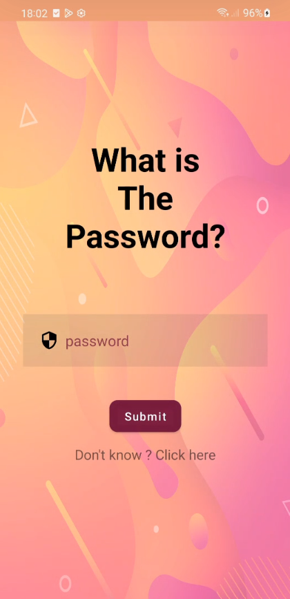
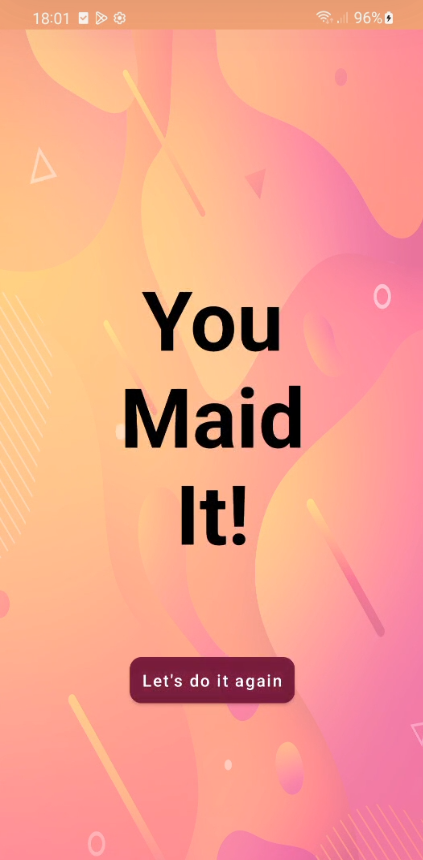

# 🔐 Permission App Game

**Welcome to the Permission App Game!**  
Your mission is to uncover the secret password using the phone’s core permissions — the ones that *don’t require user approval*. Think creatively, explore the possibilities, and see if you can crack the code.

Need a nudge? Tap the hint below for a clue.

Confident you’ve found the password? Hit the **Submit** button and see if you're right!

Good luck, detective. 🕵️‍♂️📱

## 📸 Screenshots
### Main screen
<p align="start">
  
</p>

### Success Screen
<p align="start">
  
</p>

## 🚀 Getting Started

To run this project locally:

1. **Clone the repository:**
   ```bash
   git clone https://github.com/TalBar4444/PermissionsApp.git
   cd PermissionsApp

## 📄 License
Copyright 2025 Tal Bar

Licensed under the Apache License, Version 2.0 (the "License");
you may not use this file except in compliance with the License.
You may obtain a copy of the License at

   http://www.apache.org/licenses/LICENSE-2.0

Unless required by applicable law or agreed to in writing, software
distributed under the License is distributed on an "AS IS" BASIS,
WITHOUT WARRANTIES OR CONDITIONS OF ANY KIND, either express or implied.
See the License for the specific language governing permissions and
limitations under the License.

